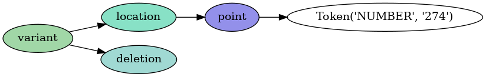

Usage
=====

This package provides a command line interface. To see the full options list,
use ``-h``.

.. code-block:: console

    $ mutalyzer_hgvs_parser -h
    usage: mutalyzer_hgvs_parser [-h] [-v] [-r R] [-c | -g G] [-i I] description

    positional arguments:
      description  the HGVS variant description to be parsed

    optional arguments:
      -h, --help   show this help message and exit
      -v           show program's version number and exit
      -r R         alternative start (top) rule for the grammar
      -c           convert the description to the model
      -g G         alternative input grammar file path
      -i I         save the parse tree as a PNG image (pydot required!)

Syntax check
------------

To only check if a description can be successfully parsed.

.. code-block:: console

    $ mutalyzer_hgvs_parser 'NG_012337.1(SDHD_v001):c.274G>T'
    Successfully parsed:
     NG_012337.1(SDHD_v001):c.274G>T

Description model
-------------------------

To obtain the model of a description add the ``-c`` flag.

.. code-block:: console

    $ mutalyzer_hgvs_parser -c 'NG_012337.1(SDHD_v001):c.274G>T'
    {
      "reference": {
        "id": "NG_012337.1",
        "selector": {
          "id": "SDHD_v001"
        }
      },
      "coordinate_system": "c",
      "variants": [
        {
          "type": "substitution",
          "source": "reference",
          "location": {
            "type": "point",
            "position": 274
          },
          "deleted": [
            {
              "source": "description",
              "sequence": "G"
            }
          ],
          "inserted": [
            {
              "source": "description",
              "sequence": "T"
            }
          ]
        }
      ]
    }

Grammar start rule
------------------

By default, the Mutalyzer grammar is used, with ``description`` as the start (top)
rule. It is however possible to choose a different start rule with the ``-r`` option.

.. code-block:: console

    $ mutalyzer_hgvs_parser -r variant '274G>T'
    Successfully parsed:
     274G>T

Parse tree representation
-------------------------

If pydot_ is installed, an image of the lark parse tree can be obtained
with the ``-i`` option.

.. code-block:: console

    $ mutalyzer_hgvs_parser "274del" -r variant -i tree.png
    Successfully parsed:
     274del
    Parse tree image saved to:
     tree.png

.. _pydot: https://pypi.org/project/pydot/
