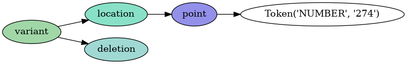

Usage
=====

This package provides a :doc:`command line interface <cli>`.

Syntax check
------------

To only check if a description can be successfully parsed.

.. code-block:: console

    $ mutalyzer_hgvs_parser 'NG_012337.1(SDHD_v001):c.274G>T'
    Successfully parsed:
     NG_012337.1(SDHD_v001):c.274G>T

Description model
-----------------

To obtain the model of a description add the ``-c`` flag.

.. code-block:: console

    $ mutalyzer_hgvs_parser -c 'NG_012337.1(SDHD_v001):c.274G>T'
    {
      "reference": {
        "id": "NG_012337.1",
        "selector": {
          "id": "SDHD_v001"
        }
      },
      "coordinate_system": "c",
      "variants": [
        {
          "type": "substitution",
          "source": "reference",
          "location": {
            "type": "point",
            "position": 274
          },
          "deleted": [
            {
              "source": "description",
              "sequence": "G"
            }
          ],
          "inserted": [
            {
              "source": "description",
              "sequence": "T"
            }
          ]
        }
      ]
    }

Parsing a partial description
-----------------------------

By default the parser expects a complete HGVS description
(e.g. ``NG_012337.1:g.274G>T``). If you only have a *part* of a
description — a bare variant, a location, or a reference — you can tell
the parser where to start by passing a **start rule** with the ``-r``
option.

A start rule is the name of the grammar rule that the input must match.
The most useful alternatives to the default (``description``) are:

.. list-table::
   :header-rows: 1
   :widths: 20 80

   * - Start rule
     - Matches
   * - ``description``
     - A complete HGVS description *(default)*
   * - ``variant``
     - A single variant without a reference, e.g. ``274G>T`` or ``10del``
   * - ``variants``
     - A semicolon-separated list of variants, e.g. ``[274G>T;280del]``
   * - ``location``
     - A position or range, e.g. ``274`` or ``10_20``
   * - ``reference``
     - A reference identifier, e.g. ``NG_012337.1`` or ``NG_012337.1(SDHD_v001)``
   * - ``inserted``
     - An inserted sequence, e.g. ``ATG`` or ``NG_012337.1:c.1_10``

.. code-block:: console

    $ mutalyzer_hgvs_parser -r variant '274G>T'
    Successfully parsed:
     274G>T

The ``-c`` flag can be combined with ``-r`` to convert a partial
description to its model.

.. code-block:: console

    $ mutalyzer_hgvs_parser -c -r variant '274G>T'
    {
      "location": {
        "type": "point",
        "position": 274
      },
      "type": "substitution",
      "source": "reference",
      "deleted": [
        {
          "sequence": "G",
          "source": "description"
        }
      ],
      "inserted": [
        {
          "sequence": "T",
          "source": "description"
        }
      ]
    }

Parse tree representation
-------------------------

An image of the parse tree can be obtained with the ``-i`` option.
This requires Graphviz_ to be installed on your system (e.g.
``apt install graphviz`` on Debian/Ubuntu) and pydot_:

.. code-block:: console

    pip install mutalyzer-hgvs-parser[plot]

.. code-block:: console

    $ mutalyzer_hgvs_parser "274del" -r variant -i tree.png
    Successfully parsed:
     274del
    Parse tree image saved to:
     tree.png

.. _Graphviz: https://graphviz.org/
.. _pydot: https://pypi.org/project/pydot/
